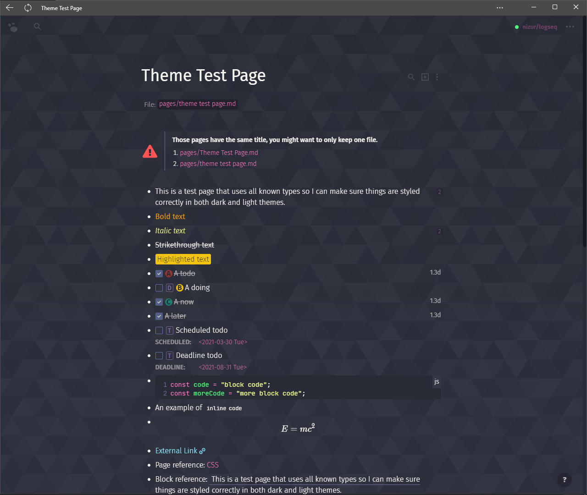
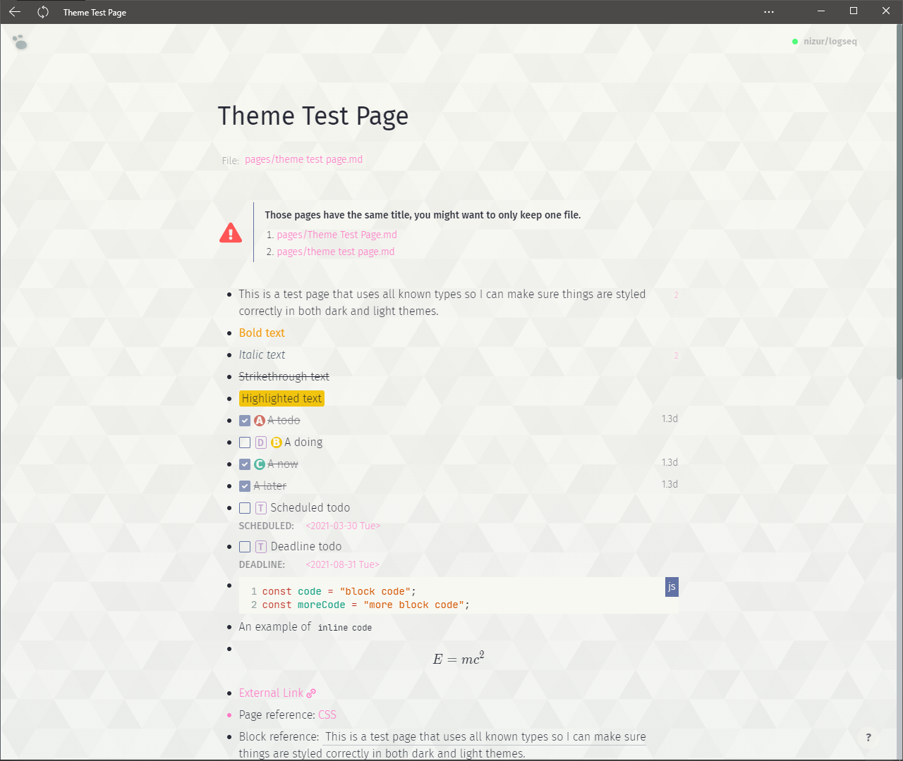

# Draculish for [Logseq](http://logseq.com)

> A dark/light theme for [Logseq](http://logseq.com).

Special thanks to [DenaroCF](https://github.com/DenaroCF) for testing the theme.

## Install

#### Offline install:

Copy the content of `custom.css` into `logseq/custom.css` in your notes repo if you want to have the theme available without internet connection.

#### Online install:

- Paste this line to your `logseq/custom.css` file:
  `@import url('https://raw.githack.com/nizur/draculish/master/custom.css');`

## License

[MIT License](./LICENSE)
